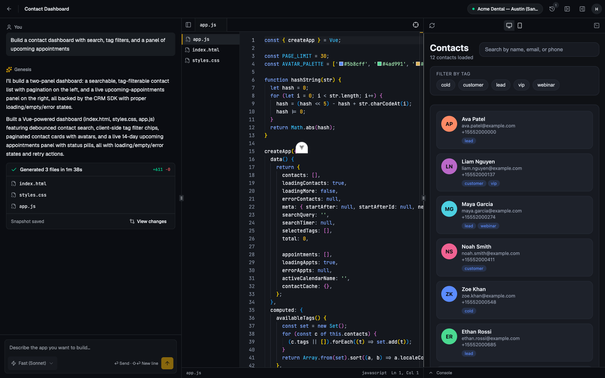
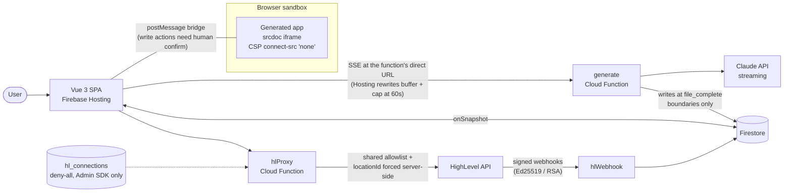
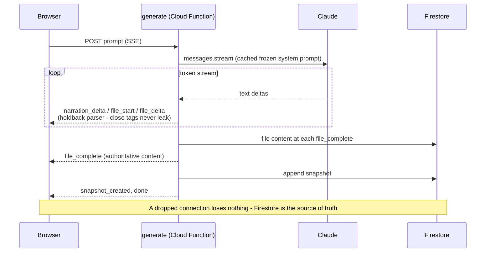

# Genesis — AI-Powered HighLevel App Builder

[](https://github.com/sattyamjjain/PyVerseAI/actions/workflows/highlevel-ai-app-builder-ci.yml)

Describe an app in plain English → Claude generates it live, streamed token-by-token into a Monaco editor → the preview runs it against **real HighLevel CRM data** (Contacts, Conversations, Calendars) through a secured proxy. Built for the HighLevel Senior Engineer take-home.



**Stack:** Vue 3 + TypeScript + shadcn-vue · Firebase (Auth, Firestore, Cloud Functions v2) · Claude (`@anthropic-ai/sdk`, streaming) · Monaco · HighLevel API 2.0 (OAuth)

## Live URLs

- **App (Firebase Hosting):** https://genesis-hl-builder-sj.web.app
- **Cloud Functions base:** https://us-central1-genesis-hl-builder-sj.cloudfunctions.net
- **Health probe:** [`GET healthz`](https://healthz-rttqk4rz4q-uc.a.run.app) (liveness + Firestore readiness)
- **Loom walkthrough:** _link goes here_

> The full senior-engineer checklist — reliability, scalability, security, testing, observability, performance, accessibility — with per-item evidence lives in [PRODUCTION_READINESS.md](./PRODUCTION_READINESS.md). The threat model lives in [SECURITY.md](./SECURITY.md).

## Reviewing this submission? Start here

**60-second live tour** (needs a HighLevel account): sign up at the [live app](https://genesis-hl-builder-sj.web.app) → Connect HighLevel → pick a sandbox location → Seed demo data → click the "Contact dashboard with search" suggestion chip → watch the stream, then use the app it built on your real CRM data.

**5-minute local tour** (no HighLevel account needed): follow [Local setup](#local-setup-firebase-emulators) — `HL_MOCK_MODE` ships a faithful HighLevel simulator, so everything incl. OAuth runs offline.

| Requirement | Where | Proof in 30 seconds |
|---|---|---|
| Email/password auth + session persistence | `frontend/src/views/Sign{In,Up}View.vue`, `stores/auth.ts` | Sign in, refresh the page |
| HighLevel OAuth + token refresh (rotating) | `functions/src/oauth.ts`, `functions/src/hl/client.ts` | Connect flow live; lease-refresh logic at `hl/client.ts` |
| Project CRUD, owner-scoped rules | `frontend/src/stores/projects.ts`, `firestore.rules` | Rules test suite in `functions/test/rules.test.ts` |
| SSE streaming + event protocol | `functions/src/generate.ts`, `functions/src/shared/protocol.ts` | `node scripts/gen-test.mjs gen "..."` asserts the event sequence |
| Server-side stream parsing | `functions/src/genesis/parser.ts` | 16 parser edge-case tests in `functions/test/` |
| Monaco editor, live typing, read-only while streaming | `frontend/src/components/editor/` | Send any prompt, watch the editor |
| Live preview on real CRM data | `frontend/src/lib/srcdoc.ts`, `frontend/src/preview/bootstrap.js`, `functions/src/proxy.ts` | Generated dashboard lists your sandbox contacts |
| Snapshots + restore | `functions/src/snapshots.ts`, `SnapshotSheet.vue` | History icon → Restore → Undo |
| All 6 bonuses | see [Bonus features](#bonus-features-implemented) | Stop button, refinement prompt, View changes, 429 after 5 gen/min, Load-more in generated apps, webhook toast |

## What it does

1. **Sign up / sign in** (Firebase Auth, email + password).
2. **Connect HighLevel** — full OAuth 2.0 (`/v2/oauth/chooselocation` → Cloud Function callback → tokens in a server-only Firestore collection, rotation-safe refresh). One location per user.
3. **Create a project** and describe what you want in chat.
4. **Watch generation stream** — the Cloud Function streams Claude over SSE, parses `<genFile>` boundaries server-side, types code into Monaco live, and persists each file at its completion boundary.
5. **Live preview with real CRM data** — generated apps run in a hard-sandboxed iframe and fetch Contacts/Conversations/Calendars through the injected `genesis` SDK → postMessage bridge → `hlProxy` function → HighLevel.
6. **Iterate** — follow-up prompts modify only the changed files; a Monaco diff view shows exactly what changed.
7. **Snapshots** — every generation appends a restorable point-in-time snapshot (v0-style linear history: restore never destroys anything).

### Bonus features implemented
- Generation **cancellation** (Stop button aborts the model stream mid-flight; completed files kept, partial file discarded)
- **Iterative refinement** (full current project context, rewrite-only-changed-files contract)
- **Diff view** per generation / between snapshots (Monaco DiffEditor)
- **Rate limiting** on all endpoints (per-uid Firestore fixed-window counters + TTL cleanup: generate 5/min & 50/day, proxy 60/min)
- Generated apps handle **HighLevel pagination** (SDK exposes cursors; the system prompt teaches Load-more patterns)
- **Webhook support** — Ed25519-verified HighLevel webhooks fan out to the workspace: a new contact in the CRM pops a toast and pushes a `genesis.on('contactCreated')` event into the running preview
- **Write actions with confirmation** — generated apps can create contacts / send messages / book appointments, but every write pops an unspoofable confirmation dialog in the parent app (the sandbox has no network, so writes physically cannot bypass it)

## HighLevel setup

1. Create a developer account at [marketplace.gohighlevel.com](https://marketplace.gohighlevel.com).
2. **My Apps → Create App**: type **Private**, distribution **Sub-Account** (location-level installs only — this guarantees `user_type: Location` tokens).
3. **Settings → Client Keys**: generate a Client ID + Client Secret (secret is shown once).
4. **Auth settings → Scopes** — enable exactly:
   `contacts.readonly contacts.write conversations.readonly conversations/message.readonly conversations/message.write calendars.readonly calendars/events.readonly calendars/events.write locations.readonly users.readonly`
5. **Redirect URL** — add the deployed callback verbatim:
   `https://us-central1-<project-id>.cloudfunctions.net/hlAuthCallback`
6. **Webhooks (optional bonus)** — in the app's Advanced Settings → Webhooks, set the webhook URL to
   `https://us-central1-<project-id>.cloudfunctions.net/hlWebhook` and toggle on: ContactCreate, ContactUpdate, ContactDelete, InboundMessage, AppointmentCreate, AppointmentUpdate. Signature verification (current Ed25519 `x-ghl-signature` + legacy RSA `x-wh-signature`) ships enabled — both HighLevel public keys are baked into the per-project env file. An **UNINSTALL** event purges the user's stored tokens and flips their connection status — uninstalling from HighLevel cleanly disconnects Genesis. The requested scope list above is deliberately minimal: exactly what the three CRM areas need, nothing more.
7. **Sandbox** — developer portal → **Testing → Create App Test Account** (free, no trial needed). Create **one calendar** in it (Settings → Calendars) so appointment features have somewhere to book. In-app: **Connect HighLevel → Seed demo data** fills the sandbox with contacts, inbound SMS threads, and appointments.

## Local setup (Firebase emulators)

```bash
# 1. Install deps
npm --prefix frontend install
npm --prefix functions install

# 2. Secrets for the emulator (gitignored)
#    functions/.secret.local  →  ANTHROPIC_API_KEY=sk-ant-…   (required for generation)
#    functions/.env ships with HL_MOCK_MODE=true — a built-in HighLevel mock
#    (OAuth + all CRM routes), so no HighLevel account is needed locally.

# 3. Build functions + start emulators (auth/firestore/functions run fully offline)
npm --prefix functions run build
firebase emulators:start --only auth,functions,firestore --project demo-genesis

# 4. Frontend dev server (connects to emulators automatically in dev)
npm --prefix frontend run dev          # → http://localhost:5173

# 5. Tests
npm --prefix functions test            # parser / allowlist / paths / Firestore rules (39 tests)
npm --prefix frontend run test:unit    # SSE client / srcdoc assembler / stores (44 tests)
npm --prefix frontend run build        # vue-tsc type-check + production build
# CI runs all of the above (rules against a real Firestore emulator) on every
# push/PR: .github/workflows/highlevel-ai-app-builder-ci.yml

# 6. Headless generation harness (SSE consumer with event-sequence assertions)
node scripts/gen-test.mjs gen "build a contact dashboard with search"
```

To develop against **real** HighLevel locally: set `HL_MOCK_MODE=false` and real `HL_CLIENT_ID`/`HL_CLIENT_SECRET`, and register the deployed `hlAuthCallback` as the redirect URL — the callback returns the browser to whatever origin started the flow (localhost included), so no tunnel is needed.

## Architecture



One generation, end to end:



## Architecture decisions

- **Server-side stream parsing.** The Cloud Function parses Claude's `<genApp>/<genFile>` output with a holdback-buffer state machine (a close-marker can never leak into content across chunk splits) and emits *semantic* SSE events (`file_start/file_delta/file_complete/snapshot_created/done/error`). The browser stays dumb; Firestore — written only at file boundaries — is the single durable source of truth, so a dropped connection loses nothing.
- **SSE at the function's direct URL.** Firebase Hosting rewrites buffer responses and cap requests at 60 s, which kills streaming — all API calls go to `cloudfunctions.net` directly with exact-origin CORS.
- **Preview = sandboxed `srcdoc` iframe with zero network.** `sandbox="allow-scripts allow-forms"` (opaque origin — `allow-forms` only revives form *events*; actual submission stays double-blocked by CSP `form-action 'none'` plus a capture-phase `preventDefault` in the injected bootstrap) with CSP `connect-src 'none'`; the only data path is a postMessage bridge validated against the same endpoint allowlist the server enforces (one shared module). The user's Firebase token never enters the iframe, and prompt-injected exfiltration is structurally impossible, not policy-discouraged.
- **Tenant forcing in the proxy.** `hlProxy` rebuilds every upstream URL from its own template, copies only allowlisted query keys, and overwrites `locationId` (query *and* body) from the caller's stored connection — cross-tenant access would require forging Firestore, not a query string.
- **Rotation-safe token refresh.** HighLevel rotates refresh tokens (single-use); refreshes serialize through a short Firestore lease taken in a transaction, with the network call outside the transaction and both tokens persisted immediately — two concurrent requests can't brick the connection.
- **Byte-frozen system prompt for prefix caching.** Nothing volatile is interpolated into the system prompt; project files travel in `messages`, sorted by path with stable serialization. Refinements cost ~5–6¢ (cache reads at 0.1×), verified via `usage.cache_read_input_tokens`.
- **Full-file-rewrite refinement.** The model re-emits only changed files, each complete (Aider-style search/replace buys pennies here and costs a robustness project); the same parser and live-typing path serve first generations and refinements alike.
- **Append-only snapshots (v0 semantics).** Every generation snapshots the resulting state; restore = backup current → apply target → append restored state. History is linear and nothing is ever destroyed, which makes "Undo restore" trivial.
- **Two-layer defense on generated code.** Post-stream validation (path safety, egress allowlist, forbidden APIs, secret-shape tripwires) catches bad output early and a cheap Haiku repair pass fixes truncated files — but the sandbox CSP is the boundary that actually holds.
- **Mock-first development.** `HL_MOCK_MODE` swaps a faithful HighLevel simulator (OAuth included) behind the same client, so the entire product runs offline on emulators; real credentials were wired in only at deploy time.

## What I would improve

- Move the preview to a dedicated `/preview.html` origin with per-path CSP headers, restoring a strict `script-src` on the host app (srcdoc inherits the parent CSP by spec).
- Replace the bridge's `'*'` response targeting with a MessageChannel port handshake, deleting the last theoretical postMessage residual.
- App-layer AES-256-GCM on stored HighLevel tokens (Secret Manager key) + Firebase App Check enforcement on all endpoints.
- Durable generation queue (Cloud Tasks) so a closed laptop mid-generation resumes instead of aborting, plus resumable SSE via `Last-Event-ID`.
- Multi-location support per user (the token store is already keyed for it) and a project-level model picker with per-generation cost display.

## Deployment notes

```bash
firebase login
firebase projects:create <project-id>          # or use the console
firebase use <project-id>                      # writes .firebaserc
# Upgrade the project to the Blaze plan (console) — required for Cloud
# Functions v2 + outbound network. Real usage for this app is ≈ $0 + tokens.

firebase functions:secrets:set ANTHROPIC_API_KEY
firebase functions:secrets:set HL_CLIENT_SECRET
# functions/.env (prod values): HL_CLIENT_ID, HL_REDIRECT_URI (deployed
# hlAuthCallback URL), APP_ORIGINS (hosting origins + localhost), HL_MOCK_MODE=false

firebase deploy --only firestore               # rules + composite indexes
firebase deploy --only functions               # first run enables Cloud Build/Run APIs
# frontend/.env.production: VITE_FIREBASE_* web config + VITE_FUNCTIONS_BASE
firebase deploy --only hosting                 # builds frontend via predeploy

# Then register the OAuth Redirect URL + webhook URL in the HighLevel app.
```

CI runs on every push/PR (typecheck + full test suites, rules against a live Firestore emulator: `.github/workflows/highlevel-ai-app-builder-ci.yml`); there is deliberately no CD — deploys are the three commands above. `maxInstances` caps every function (cost ceiling); Firestore TTL policies clean `rate_limits`, `webhook_dedupe`, and `hl_events`:

```bash
gcloud firestore fields ttls update expireAt --collection-group=rate_limits --enable-ttl
gcloud firestore fields ttls update expireAt --collection-group=webhook_dedupe --enable-ttl
gcloud firestore fields ttls update expireAt --collection-group=hl_events --enable-ttl
```
