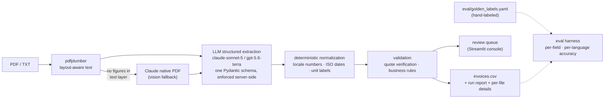

# Utility Invoice Processing with LLMs

Extracts structured data from **real utility invoices in 4 languages** (electricity, gas, water, sewer) using schema-enforced LLM structured outputs, and writes a validated CSV — with per-field evidence quotes, hallucination filtering, and a measured accuracy report.

**Results on the committed sample set** (8 real bills → 11 commodity rows, hand-labeled ground truth):

| | claude-sonnet-5 | gpt-5.6-terra (same prompt/schema) |
|---|---|---|
| Field accuracy (7 fields × 11 rows) | **98.7%** | 84.4% |
| `usage_amount` / `usage_unit` / period dates | 100% exact | — |
| Hallucinated fields | 1 (flagged for review by quote verification) | — |
| Cost per invoice | $0.049 | $0.025 |

Full breakdown: [`outputs/eval_report.md`](outputs/eval_report.md) · run telemetry: [`outputs/run_report.anthropic.json`](outputs/run_report.anthropic.json)

> **Why an LLM?** As of July 2026 no major cloud sells a utility-bill-specific extractor: Google retired Document AI's utility parser on June 30, 2026 (recommending foundation models as the migration path), AWS's own utility-bill reference architecture calls Claude on Bedrock rather than Textract, and Azure's `prebuilt-invoice` has six address types and a service-period pair but **no usage field at all** — its only unit field is documented as *"e.g., kg, lb"*. The two fields most specific to this task are exactly the ones you cannot buy off the shelf.

## Quickstart

**Zero-key path (2 minutes, $0):** the repo ships the raw model responses as fixtures, so you can reproduce the committed CSV byte-for-byte and run every test without any API key.

```bash
uv sync --all-extras          # or: python -m venv .venv && source .venv/bin/activate && pip install -e ".[ui]"
make run-mock                 # replays fixtures -> outputs/invoices.csv (byte-identical)
make test                     # 113 tests, no network, no key
make eval                     # per-field accuracy table from hand-labeled golden data
```

**Live extraction:** copy `.env.example` → `.env`, add a key, then

```bash
make run                      # Claude on samples/ -> outputs/invoices.csv
make run-openai               # same run via OpenAI -> outputs/invoices.openai.csv
make run-edge                 # includes the deliberate trap bills
make ui                       # Streamlit review console for flagged fields
```

## Architecture



The load-bearing boundary: **the LLM does semantics, deterministic code does everything checkable.** The model finds fields and quotes its evidence verbatim; Python parses the numbers and dates, verifies the quotes, and applies business rules. That split is what makes the pipeline unit-testable (most of the 113 tests run on pure functions) and is where multilingual bills actually break — normalization, not comprehension.

### How the LLM is used

- **One English prompt for all languages.** The model reads Spanish/French/German bills directly and returns values as printed plus a verbatim `source_quote` per field; the document's language becomes a schema field for free. No per-language prompts, no translation pass.
- **Schema-enforced structured outputs** on both providers (Anthropic `messages.parse`, OpenAI strict `json_schema`) — the schema's field descriptions *are* the core of the prompt, so both providers see identical instructions and become directly comparable in the eval.
- **Null over guessing, verified.** Every field is nullable and every value needs evidence: quotes are substring-checked against the extracted text (space-insensitively — PDF extractors merge kerned words). A value whose "evidence" isn't in the document is flagged `quote_unverified_*` and the row routes to review. That's a deterministic hallucination filter in ~15 lines, and it's also why there are **no logprobs and no fake confidence floats** here: Anthropic exposes no logprobs, and self-reported numeric confidence is documented to be poorly calibrated. Categorical statuses (`confident / ambiguous / inferred / not_found`) + verified evidence carry more information honestly.
- **Vision as a fallback, not a default.** Native PDF input is billed as image + text per page (~10× the cost of text extraction), so it engages only when the text layer exists but carries no figures — which is exactly what happened with the EDF bill (an image-body PDF): the text-mode pass honestly returned `not_found`, the pipeline retried through Claude's PDF input, and the vision pass read 11 897 kWh off the page images.

### Choices a reviewer will wonder about

- **One CSV row per (invoice × commodity).** The We Energies sample bills both gas *and* electricity, with separate meters and usage. Flattening that to one row loses real data; Arcadia and UtilityAPI both model it per-commodity. `utility_type` is a row property, not a document property.
- **Usage is anchored to stated totals, never summed** — on a real French commercial bill, summing every kWh line yields ~2× actual consumption because capacity components restate the same energy. One narrow exception, forced by the Iberdrola sample (which prints *no* total anywhere): a complete disjoint register split (peak 163 + valley 187) may be summed, marked `usage_source=summed_components`, `status=inferred`, review-routed.
- **Unit labels are normalized; values are never converted.** CCF→therms needs a per-utility, per-month heat factor (We Energies prints ×1.062, MidAmerican ×0.974×1.058 — same continent, same schema, different factors). Hard-coding a factor is silently wrong; the honest output is the unit that sits next to the number the bill states.
- **Dates: the LLM converts, code cross-checks.** The model has whole-document locale context (language, currency, address country) that no date library has, so it emits ISO; `dateparser`, seeded with the detected locale, independently re-derives the date from the verbatim quote. Disagreement doesn't silently pick a winner — it flags. Day/month swaps are exactly the error this catches.
- **No LangChain / no framework.** Both providers' native SDKs already do schema enforcement server-side and retry transient failures; a framework would wrap those same calls in indirection a reviewer must read. The first dependency I'd add at scale is listed in [`DECISIONS.md`](DECISIONS.md).
- **`pdfplumber` (MIT)** with `layout=True` — position carries meaning on invoices. PyMuPDF extracts well but is AGPL-3.0, a real constraint for commercial use; noticing licenses is part of the engineering.

## Sample set

11 bills, all **downloaded from public sources, none generated** — 4 languages (en/es/fr/de) × 4 commodity types, including one genuine production invoice (Iberdrola), a dual-fuel bill whose period must be derived from meter-read dates, an image-only bill (vision path), and three deliberate traps (placeholder dates, year-less periods, an internally contradictory period). Full provenance with per-file "why it earns its slot": [`samples/SOURCES.md`](samples/SOURCES.md).

## Validation & testing

Three test tiers (all key-free by default) plus a measurement harness — the full write-up, including the edge-case matrix, golden-label judgment calls, and what broke during development, is in [`TESTING.md`](TESTING.md):

1. **Pure-function unit tests** on normalizers/validators — every historical failure mode gets a case (`2.157,5`→2157.5, `48 469`→48469, `5,67,780.22`→567780.22, kW≠kWh, zero-usage ≠ null).
2. **Fixture-replay tests** — committed raw model responses through the full downstream pipeline must reproduce the committed CSV **byte-for-byte**.
3. **Live smoke tests** behind `pytest -m live` (opt-in, costs money).

Plus `make eval`: deterministic per-field scoring against hand-labeled golden data with an error taxonomy that separates *missing-correct* from *missing-wrong* from **hallucinated** — because a model that invents a value is categorically worse than one that says "not found".

## Cost

$0.049/invoice live (claude-sonnet-5, ~10.9k in / ~1.1k out tokens per invoice). At 10k invoices/month that's ≈$490; prompt-caching the static schema/instructions block and moving to the Batch API brings it to roughly $150–250/month, and the identical-prompt design means the accuracy/cost frontier (98.7% @ $0.049 vs 84.4% @ $0.025 above) is measured, not guessed.

## Deliberately left out

OCR for scanned paper (vision covers image-PDFs; Tesseract adds a system dependency this corpus doesn't need) · async/concurrent extraction (8 documents don't justify it; a thread pool is the first scale lever) · a database (CSV *is* the deliverable) · Docker (uv sync is faster than a build) · retry queues, webhooks, auth. Each absence is a decision, not an omission — reasoning in [`DECISIONS.md`](DECISIONS.md).

## Assumptions

Text-based PDFs are the primary input (per the brief; OCR out of scope) · bills are single-invoice documents (multi-invoice concatenations would need a splitter) · `en` defaults to US date order (MDY) with the cross-checker as the safety net · the committed accuracy figures are indicative, not statistical — 11 rows labeled by one annotator (me), a bias named explicitly in TESTING.md.

## Repo layout

```
src/invoice_extractor/   schema.py (the contract) · prompts.py · normalize.py ·
                         validate.py · pipeline.py · providers/ (anthropic, openai,
                         mock) · ingest.py · csv_writer.py · evaluate.py · cli.py
samples/                 8 bills + edge_cases/ + SOURCES.md (provenance)
fixtures/responses/      recorded raw model outputs (the $0 replay path)
eval/golden_labels.yaml  hand-labeled ground truth
outputs/                 committed CSVs, eval reports, run telemetry, per-file details
tests/                   113 tests · app/streamlit_app.py  review console
```
